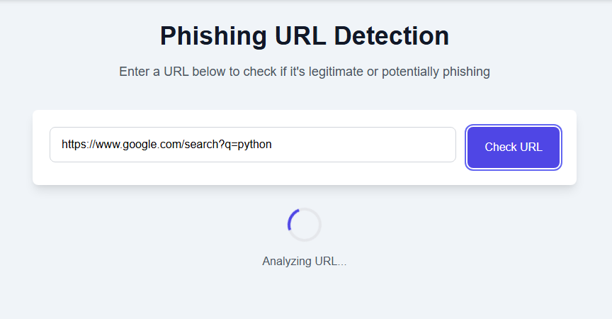
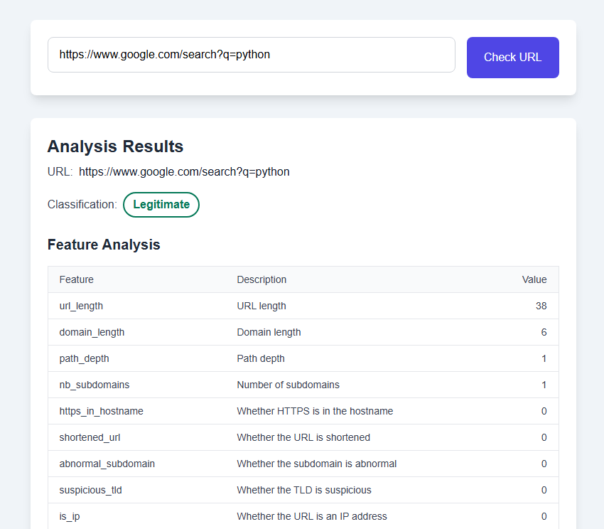
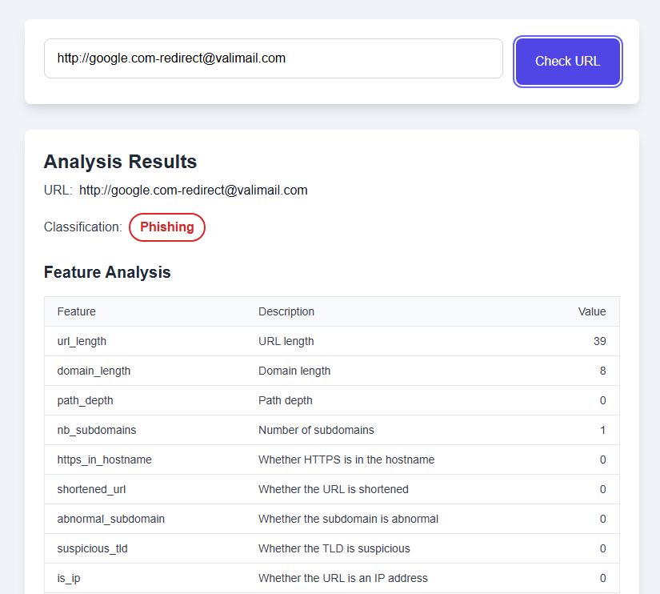
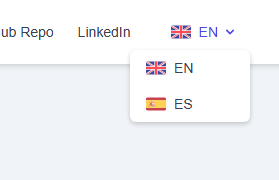
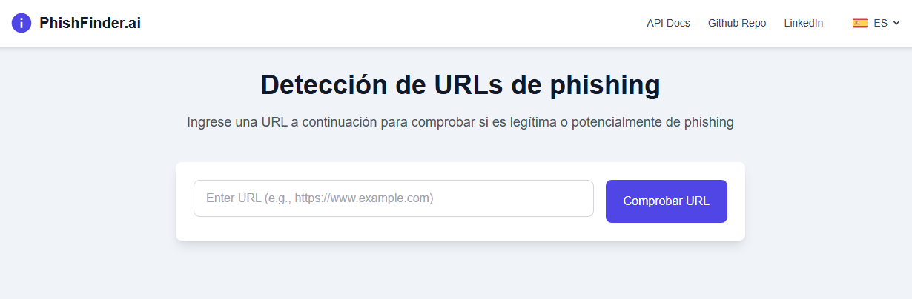
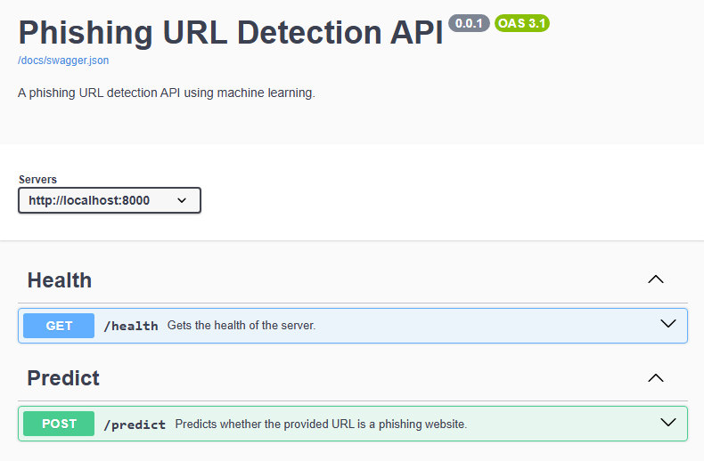
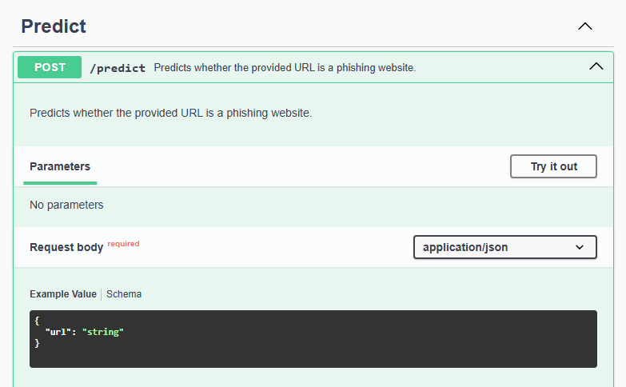
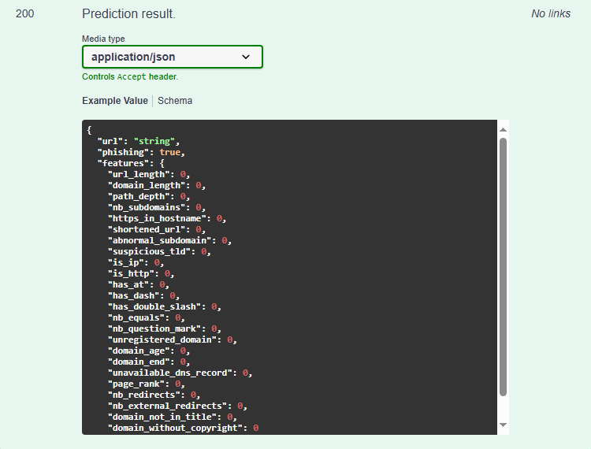

<!-- omit in toc -->
# Phishing URL Detector

A phishing URL detection application using machine learning, built with
Starlette framework.

<!-- omit in toc -->
## Table of Contents
- [Features](#features)
- [Prerequisites](#prerequisites)
- [Installation](#installation)
- [Configuration](#configuration)
- [Running the Application](#running-the-application)
    - [Previews](#previews)
        - [Home](#home)
        - [API Documentation](#api-documentation)
- [Project Structure](#project-structure)
- [API Endpoints](#api-endpoints)
- [Development](#development)
    - [Machine Learning Model](#machine-learning-model)
    - [URL Feature Extraction](#url-feature-extraction)
    - [Internationalization](#internationalization)
    - [Testing](#testing)
- [License](#license)
- [Support](#support)

## Features

- **URL Analysis**: Advanced phishing detection using machine learning
- **Feature Extraction**: Comprehensive URL feature analysis including:
  - Address bar-based features
  - Domain-based features
  - Content-based features
- **Modern API Framework**: Built with Starlette for high performance and async support
- **API Documentation**: Automatic OpenAPI/Swagger documentation
- **Internationalization**: Multi-language support (English and Spanish)
- **Web Interface**: Clean and intuitive UI for URL analysis
- **Real-time Analysis**: Immediate feedback on URL legitimacy
- **Detailed Reports**: Comprehensive feature analysis for each URL check

## Prerequisites

- Python 3.10+
- pip (Python package manager)

## Installation

1. Clone the repository:
```bash
git clone <repository-url>
cd phishing-url-detector
```

2. Create and activate a virtual environment:
```bash
python -m venv venv
source venv/bin/activate  # On Windows: venv\Scripts\activate
```

3. Install dependencies:
```bash
pip install -r requirements.txt
```

4. Copy the environment template:
```bash
cp .env.example .env
```

## Configuration

Configure your `.env` file with appropriate values:

```bash
# Server
HTTP_SCHEMA=http
HOST=localhost
PROD=False
PORT=8000

# API Spec
OPENAPI_TITLE=Phishing URL Detection API
OPENAPI_DESCRIPTION=A phishing URL detection API using machine learning.
OPENAPI_VERSION=0.0.1
```

## Running the Application

1. Start the development server:
```bash
python main.py
```

Assuming the default configuration, the application will be available at:
- Web Interface: http://localhost:8000
- API Documentation: http://localhost:8000/docs

### Previews

#### Home
Interactive web interface for URL analysis with real-time results:








Select your preferred language:





#### API Documentation
Comprehensive API documentation with Swagger UI:







## Project Structure

```
├── core/             # Core functionality
├── data/             # Data files
├── dtos/             # Data Transfer Objects
├── extractors/       # URL feature extractors
├── lib/              # Libraries and utilities
├── locales/          # Translation files
├── middlewares/      # Middleware components
├── models/           # ML models and data structures
├── notebooks/        # Jupyter notebooks for ML training
├── routers/          # API routes
├── services/         # Business logic
├── static/           # Static files
├── templates/        # HTML templates
├── tests/            # Test suite
└── utils/            # Utility functions
```

## API Endpoints

- `POST /predict`
  - Analyzes a URL for phishing characteristics
  - Request body: `{"url": "https://example.com"}`
  - Response: Prediction results with detailed feature analysis

## Development

### Machine Learning Model

The model is trained using various URL features, such as:
- URL length
- Domain characteristics
- Content analysis

Training notebooks are available in the `notebooks/` directory.

### URL Feature Extraction

Features are extracted using the `URLFeaturesExtractor` class, which analyzes:
- Address bar features
- Domain-based features
- Content-based features

### Internationalization

Supports multiple languages through JSON locale files:
- English (`en.json`)
- Spanish (`es.json`)

### Testing

Run the test suite:
```bash
pytest
```

Coverage reports are automatically generated through GitHub Actions.

## License

This project is licensed under the MIT License. See the [LICENSE](LICENSE) file
for details.

## Support

If you find this project useful, give it a ⭐ on GitHub!
