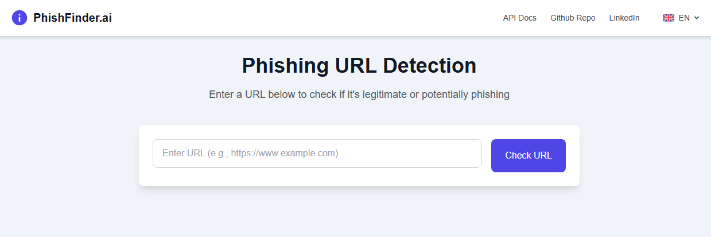
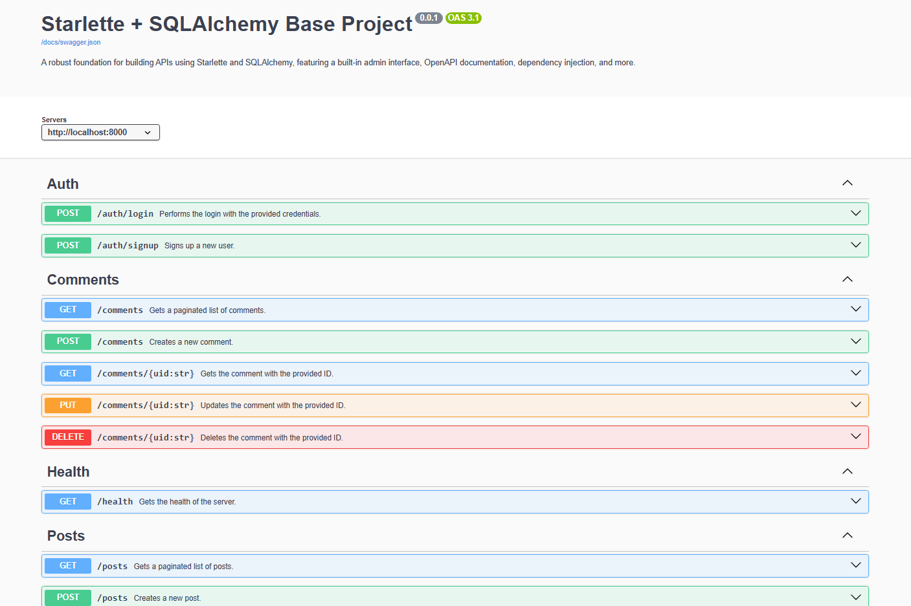
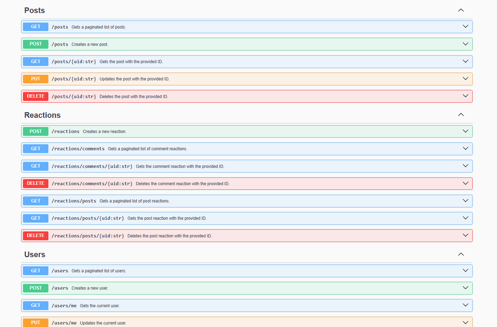
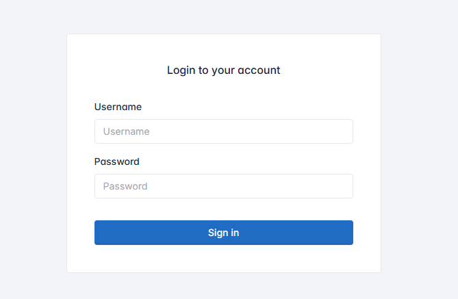
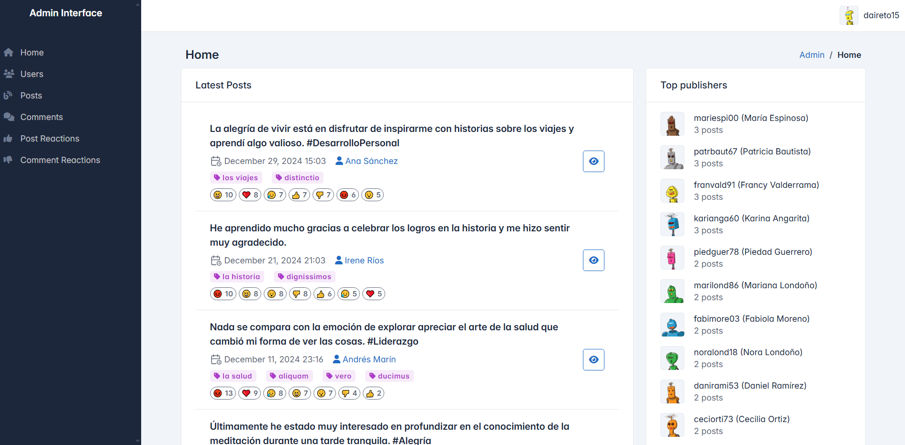
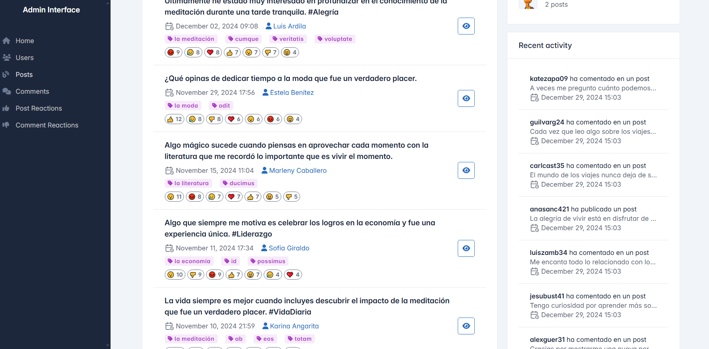
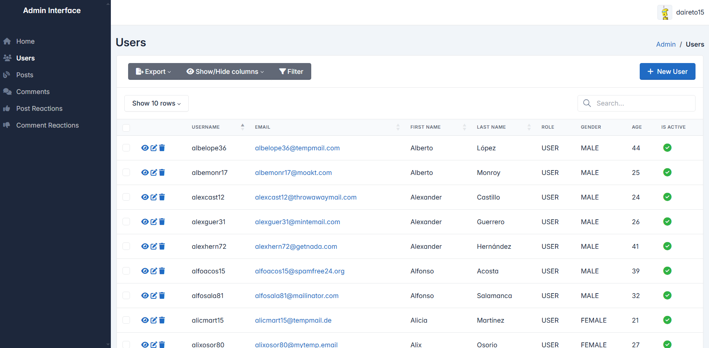
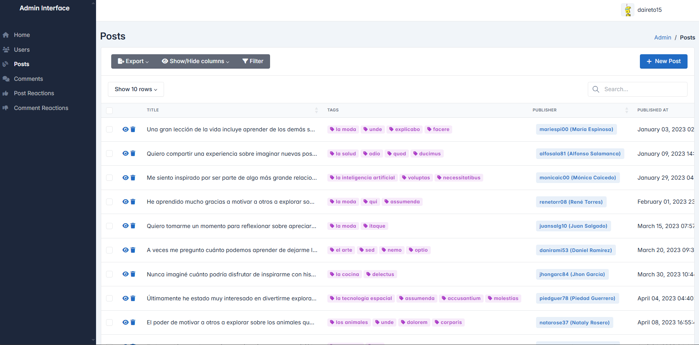
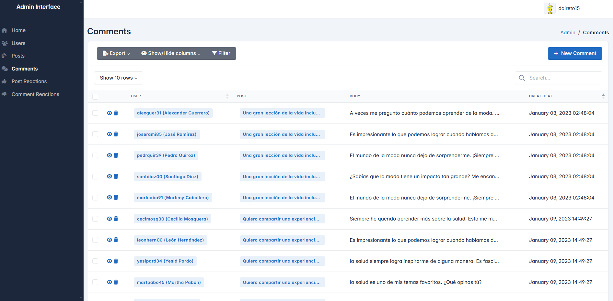
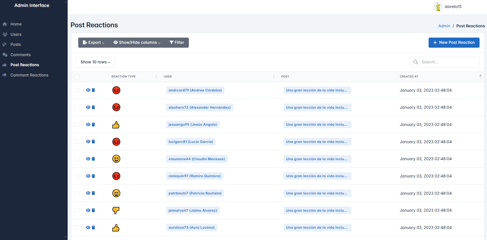

<!-- omit in toc -->
# Starlette + SQLAlchemy Base Project

[](https://coveralls.io/github/daireto/base-starlette-sqlalchemy?branch=main)

A robust foundation for building APIs using Starlette and SQLAlchemy, featuring
a built-in admin interface, OpenAPI documentation, dependency injection, and
more.

<!-- omit in toc -->
## Table of Contents
- [Features](#features)
- [Prerequisites](#prerequisites)
- [Installation](#installation)
- [Configuration](#configuration)
- [Running the Application](#running-the-application)
    - [Previews](#previews)
        - [Home](#home)
        - [API Documentation](#api-documentation)
        - [Admin Interface](#admin-interface)
- [Project Structure](#project-structure)
- [Development](#development)
    - [Entry Point](#entry-point)
    - [Settings](#settings)
    - [Dependency Injection](#dependency-injection)
    - [Adding New Models](#adding-new-models)
    - [Adding New DTOs](#adding-new-dtos)
    - [Adding New Services](#adding-new-services)
    - [Adding New Routes](#adding-new-routes)
        - [Responses](#responses)
        - [Accessing the Request Object](#accessing-the-request-object)
        - [Authentication and Authorization](#authentication-and-authorization)
        - [OData V4 Query Parameters](#odata-v4-query-parameters)
    - [Adding New Middlewares](#adding-new-middlewares)
    - [Adding New Translations](#adding-new-translations)
    - [Adding New Bases](#adding-new-bases)
    - [Adding New Exceptions](#adding-new-exceptions)
    - [Adding New Utilities](#adding-new-utilities)
    - [Adding New Templates and Static Files](#adding-new-templates-and-static-files)
    - [Environment Variables](#environment-variables)
- [License](#license)
- [Support](#support)

## Features

- **Modern API Framework**: Built with Starlette for high performance and async
    support.
- **Database Integration**: Async SQLAlchemy with ActiveRecord pattern support
    (provided by [SQLActive](https://github.com/daireto/sqlactive)).
- **Admin Interface**: Built-in admin panel for data management
    (provided by [Starlette-Admin](https://github.com/jowilf/starlette-admin)).
- **API Documentation**: Automatic OpenAPI/Swagger documentation.
- **Authentication**: JWT-based authentication system.
- **Dependency Injection**: Dependency injection for services, request path
    parameters and bodies via Pydantic models
    (provided by [Starlette DI](https://github.com/daireto/starlette-di)).
- **CORS Support**: Configurable CORS middleware.
- **Environment Configuration**: Easy environment-based configuration.
- **Logging**: Structured logging with configurable levels.
- **OData V4 Query Parameters**: Support for OData V4 query parameters provided
    by [OData V4 Query](https://github.com/daireto/odata-v4-query).
- **Database Seeding**: Sample data generation for development.
- **Type Safety**: Full type hints support.
- **Middleware Stack**: Pre-configured middleware for security and functionality.

## Prerequisites

- Python 3.10+
- A database compatible with SQLAlchemy (e.g., PostgreSQL, SQLite)

## Installation

1. Clone the repository:
```bash
git clone <this-repository-url>
cd <repository-name>
```

2. Create and activate a virtual environment:
```bash
python -m venv venv
source venv/bin/activate  # On Windows: venv\Scripts\activate
```

3. Install dependencies:
```bash
pip install -r requirements.txt
```

4. Copy the environment template:
```bash
cp .env.example .env
```

5. Configure your `.env` file with appropriate values

## Configuration

Key configuration files:
- `.env`: Environment variables.
- `logger.conf`: Logging configuration.
- `core/settings.py`: Application settings.

## Running the Application

1. Initialize and seed the database (development only):
```bash
python seed.py
```

2. Start the development server:
```bash
python main.py
```

Let's say you have configured the following values in your `.env` file:

```bash
HTTP_SCHEMA=http
HOST=localhost
PORT=8000
```

The application would be available at:

- API: http://localhost:8000
- API Documentation: http://localhost:8000/docs
- Admin Interface: http://localhost:8000/admin

### Previews

#### Home



#### API Documentation





#### Admin Interface















## Project Structure

```
├── core/                 # Core functionality
│   ├── api/              # API-related modules
│   ├── auth/             # Authentication and authorization modules
│   ├── bases/            # Base classes
│   ├── definitions.py    # Definitions
│   ├── errors.py         # Custom exceptions
│   ├── i18n.py           # Internationalization module
│   ├── locales.py        # Loaded locales
│   ├── logger.py         # Application logger (uses the `logger.conf` file)
│   └── settings.py       # Configuration
├── dtos/                 # Data Transfer Objects (DTOs)
├── lib/                  # Libraries and utilities
│   ├── admin_interface/  # Admin interface
│   └── apispec/          # OpenAPI documentation
├── locales/              # Translation files
├── middlewares/          # Middlewares
├── models/               # Database and admin interface models
├── routers/              # API routes
├── services/             # Services (business logic)
├── static/               # Static files
├── templates/            # HTML and Jinja2 templates
├── utils/                # Utility functions and classes
├── .env.example          # Environment variables template
├── logger.conf           # Logging configuration
├── main.py               # Application entry point
└── seed.py               # Database seeding script
```

## Development

### Entry Point

The entry point of the application is the `main.py` file.

The `main.py` file is responsible for:

- Configuring the application.
- Initializing the database.
- Mounting the admin interface.
- Mounting the API documentation.
- Mounting the API routes.
- Mounting the static files and templates routes.
- Registering the dependency injection container.

### Settings

The settings are defined in the `core.settings.Settings` class.

It loads the environment variables using the `starlette.config.Config` class.

> [!NOTE]
> The `status` attribute is used to check the status of the server. You can
> modify it to change the status of the server if an error occurs. The status
> is used by the `health` endpoint of `routers.health_router.HealthRouter`.

> [!WARNING]
> Don't forget to set the `PROD` environment variable to `True` when deploying
> the application to production. Also, don't forget to set safe values for the
> `ACCESS_TOKEN_SECRET` and `SESSION_SECRET_KEY` environment variables. See the
> [Environment Variables](#environment-variables) section for more information.

### Dependency Injection

Dependency injection is used to inject dependencies into services, request
path parameters and bodies via Pydantic models.

Visit the [Starlette DI](https://github.com/daireto/starlette-di) repository for
more information.

### Adding New Models

- Create your model in `models/db.py`.
- Create admin views in `models/admin.py`.

### Adding New DTOs

Create a new DTO in `dtos/` inheriting from `core.bases.base_dto.BaseDTO`.

There are two types of DTOs: `BaseRequestDTO` and `BaseResponseDTO`.

The `BaseRequestDTO` is used for the body of requests, while the
`BaseResponseDTO` is used for the body of responses.

The `BaseResponseDTO` has a `to_response` method that serializes the DTO to a
dictionary. This method is used to serialize the DTO to a dictionary before
sending it to the client.

### Adding New Services

Create a new service in `services/` inheriting from
`core.bases.base_service.BaseService`.

The `BaseService` class provides the following methods:
- `get_odata_count`: Gets the number of items in the query if the `$count`
    option is set to `True`.
- `get_async_query`: Gets an async query for the given model from the given
    OData options. Visit the [SQLActive](https://github.com/daireto/sqlactive)
    repository for more information.
- `to_paginated_response`: Converts a list of items to a paginated response.

> [!NOTE]
> If you want to register the service in the dependency injection container,
> you should create an interface (abstract class) inheriting from
> `core.bases.base_service.BaseService` and register it in the
> `ServiceCollection` instanced in `main.py`.

### Adding New Routes

Create a new router in `routers/` inheriting from
`core.bases.base_router.BaseRouter`.

You don't need to register the router
anywhere. It will be automatically registered as long as it's in the `routers/`
directory and inherits from `core.bases.base_router.BaseRouter`.

You can use the decorators defined in `core.api.methods` to create routes like
this:

```python
from core.api.methods import get, post, put, patch, delete

class ExampleRouter(BaseRouter):

    @get('/foo')
    async def foo(self):
        pass

    @post('/foo')
    async def foo(self, data: RequestDTO):
        pass

    @put('/foo/{id:str}')
    async def foo(self, id: str, data: RequestDTO):
        pass

    @patch('/foo/{id:str}')
    async def foo(self, id: str, data: RequestDTO):
        pass

    @delete('/foo/{id:str}')
    async def foo(self, id: str):
        pass
```

**Note that endpoint functions must be async.**

#### Responses

You can use the response classes defined in `core.api.responses` to return
responses from your endpoints.

#### Accessing the Request Object

You can access the request object via `self.request`.

This is done automatically by the custom implementation of the
`starlette.routing.Route` class in the `core.api.route` module
and the custom implementation of the `starlette.requests.Request` class in the
`core.api.request` module.

The request object is injected into the router class via dependency injection.
It has the following attributes:
- `id_`: Unique request ID.
- `user`: User session object.
- `service_provider`: Dependency injection service provider.

#### Authentication and Authorization

Authentication and authorization are handled by the `core.auth` module.

Use the `auth` decorator and the `Roles` enum to require authentication and
authorization for an endpoint:

```python
from core.auth.decorator import auth
from core.auth.enums import Roles

class ExampleRouter(BaseRouter):

    @auth()
    @get('/foo')
    async def foo(self):
        pass

    @auth(Roles.ADMIN)  # Requires admin role
    @get('/bar')
    async def bar(self):
        pass
```

You can also decorate the router itself to require authentication and
authorization for all endpoints:

```python
@auth()
class ExampleRouter(BaseRouter):

    @get('/foo')
    async def foo(self):
        pass

    @get('/bar')
    async def bar(self):
        pass

@auth(Roles.ADMIN)  # Requires admin role
class ExampleRouter(BaseRouter):

    @get('/foo')
    async def foo(self):
        pass

    @get('/bar')
    async def bar(self):
        pass
```

#### OData V4 Query Parameters

OData V4 query parameters are supported. You can use the `use_odata` decorator
to indicate that the endpoint uses OData V4 query parameters. Then, use the
`parse_odata` method to parse the query parameters:

```python
from core.api.odata import use_odata

class ExampleRouter(BaseRouter):

    @use_odata
    @get('/foo')
    async def foo(self):
        odata_options = self.parse_odata()  # Parsed OData V4 query
        ...
```

Visit the [OData V4 Query](https://github.com/daireto/odata-v4-query) repository
for more information.

### Adding New Middlewares

Create a new middleware in `middlewares/` inheriting from
`core.bases.base_middleware.BaseMiddleware`.

Like with routers, you don't need
to register the middleware anywhere. It will be automatically registered as long
as it's in the `middlewares/` directory and inherits from
`core.bases.base_middleware.BaseMiddleware`.

### Adding New Translations

Create a new translation file in `locales/` named as follows: `{locale_code}.json`

For example: `en.json`, `es.json`, `fr.json`, `de.json`, `it.json`, etc.

The file must have the following structure:

```json
{
    "key": "value",
    "key_with_format": "value with {format}",
    "nested": {
        "key": "value"
    }
}
```

Then you can use the translation in your code like this:

```python
from core import I18N

t = I18N()
t('key')
t('key_with_format', format='value')
t('nested.key')
```

> [!NOTE]
> The `I18N` class will automatically load the translation files and provide
> the translations, so you don't need to worry about it.
>
> Also, the `middlewares.language_middleware.LanguageMiddleware` middleware and
> the `core.bases.base_router.BaseRouter` class will automatically set the
> locale based on the `Accept-Language` header of the request. The `I18N` class
> will use the `DEFAULT_LOCALE` setting if the locale is not found.
>
> Note that the `I18N` class is registered in the dependency injection container,
> so you can inject it in your services and routers.

### Adding New Bases

Create a new base class in `core/bases/`.

### Adding New Exceptions

Create a new exception in `core/errors.py`.

### Adding New Utilities

Create your utilities in `utils/`.

Utility functions and classes should not depend on any other module in the
project.

> [!TIP]
> If the utility is a extended class or a set of classes, you should consider
> creating a new package in `lib/` instead, so you can convert it to a Python
> package in the future if needed.

### Adding New Templates and Static Files

Create your templates in `templates/` and static files in `static/`.

### Environment Variables

Key environment variables:
- `DATABASE_URL`: Database connection string.
- `PORT`: Server port (default: 8000).
- `PROD`: Production mode flag.
- `ACCESS_TOKEN_SECRET`: JWT secret key.
- `SESSION_SECRET_KEY`: Admin session key.
- `ALLOWED_HOSTS`: Allowed hosts for the server.
- `ALLOW_ORIGINS`: Allowed origins for CORS.
- `ALLOW_METHODS`: Allowed methods for CORS.
- `ALLOW_HEADERS`: Allowed headers for CORS.
- `EXPOSE_HEADERS`: Exposed headers for CORS.

## License

This project is licensed under the MIT License. See the [LICENSE](LICENSE)
file for details.

## Support

If you find this project useful, give it a ⭐ on GitHub!
